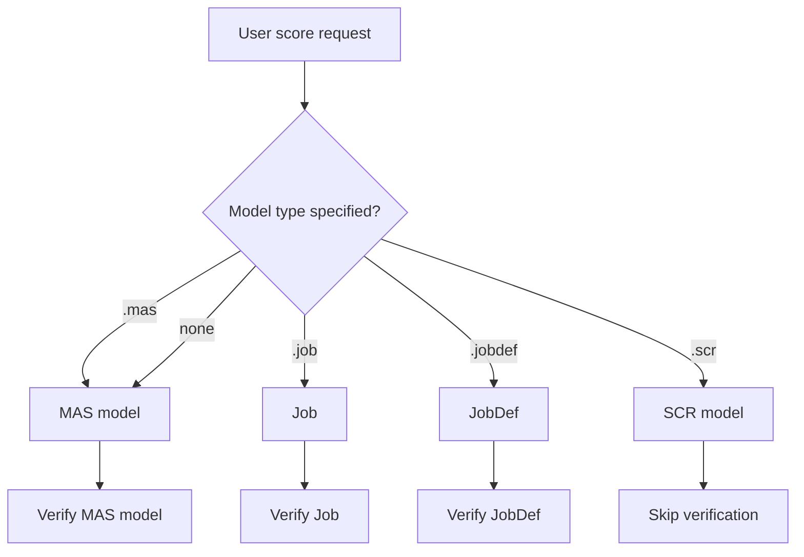

# Score Strategy

Use this strategy when the user requests model scoring, predictions, or running jobs/jobdefs.

## Prerequisites

1. Verify the model/job exists using find-resources skill
2. If scoring table rows: Verify the table exists and determine server using find-resources skill
3. If scoring with inline scenario: Parse the scenario data

---


## Step 1: Parse the Score Request

Identify the scoring target (model type) and input source:

### Identify Model Type

```
score with model X.mas       → MAS model
score with model X.job       → Job
score with model X.jobdef    → JobDef
score with model X.scr       → SCR model
score with model X (default to MAS if type is not specified) → MAS model
```

### Visual Flowchart



### Identify Input Source

```
score a=1, b=2               → Inline scenario
score with scenario {...}    → Inline scenario
score records from table X   → Table rows
score results of query...    → Query results
```

---

## Step 2: Execute Scoring

### Option A: Score with Inline Scenario

**Trigger phrases**: "score a=1, b=2", "predict with values", "score scenario"

**Tools**:
- MAS: `sas-score-mas-score`
- Job: `sas-score-run-job`
- JobDef: `sas-score-run-jobdef`
- SCR: `sas-score-scr-score`

**Flow**:
1. Find model (find-resources)
2. Score with inline data
3. Return prediction + input data merged

**Parameters** (MAS):

```
sas-score-mas-score({
  model: "<model name>",
  scenario: { a: 1, b: 2 }  
```
**Parameters** (job):                                           ):
```
sas-score-run-job({
  name: "<job name>",
  scenario: { a: 1, b: 2 }
})
```

**Parameters** (jobdef):
```
sas-score-run-jobdef({
  name: "<jobdef name>",
  scenario: { a: 1, b: 2 }
})
```

**Parameters** (SCR):
```
sas-score-scr-score({
  url: "<scr endpoint>",
  scenario: { a: 1, b: 2 }
})
```

---

### Option B: Score Table Rows (Read + Score)

**Trigger phrases**: "score records from", "run model on table", "predict for customers in", "score rows from"

**Flow**:
1. Find model (find-resources)
2. Find table (find-resources) → get server
3. Read rows from table (read-strategy)
4. Score each row (or batch score)
5. Merge predictions with original rows

**Decision**: Read strategy first
- If user requests aggregation: Use `sas-score-sas-query`
- If user requests raw rows: Use `sas-score-read-table`

**Example workflow**:
```
Request: "score records from Public.customers with model risk_model"

1. Find table customers in Public → CAS
2. Find model risk_model → MAS
3. Read rows: sas-score-read-table({ lib: "Public", table: "customers", server: "cas", limit: 1000 })
4. Score each row: for each row, sas-score-mas-score({ model: "risk_model", scenario: {row} })
5. Merge: combine risk score with customer data
```

---

## Step 3: Result Formatting

### MAS Scoring Result

Return merged object:
```
Input data + Prediction fields
Example: { a: 1, b: 2, prediction: 0.85, probability_0: 0.15, probability_1: 0.85 }
```

### Job/JobDef Result

Return execution output:
```
Tables, logs, listings as returned by job
```

### SCR Result

Return merged object:
```
Input data + Prediction fields from SCR response
```

### Batch Scoring (Table Rows)

Return rows with predictions appended:
```
[
  { customer_id: 1, name: "Alice", ..., risk_score: 0.32 },
  { customer_id: 2, name: "Bob", ..., risk_score: 0.78 },
  ...
]
```

---

## Column/Variable Mapping

If table columns don't match model input variable names:

1. Ask user: "Which table column maps to model input X?"
2. Wait for mapping: e.g., { customer_age: age, customer_income: income }
3. Transform row data using mapping
4. Score transformed data
5. Return with original column names

---

## Error Handling

| Error | Action |
|---|---|
| Model not found | Verify model name with user |
| Table not found | Verify table name and library |
| Scenario mismatch | Ask user to verify input variable names |
| Empty table | Ask whether to adjust filter or continue |
| Scoring failure | Return error message from scoring tool |

---

## Examples

### Example 1: Score with inline scenario
**Request**: "score a=1, b=2 with model simplejob.job"
1. Find job simplejob using find-resources strategy
2. Run: `sas-score-run-jobdef({ name: "simplejob", scenario: { a: 1, b: 2 } })`
3. Return: `{ c: 3 }`

### Example 2: Score with MAS model
**Request**: "predict churn for age=45, income=60000 with model churn_predictor"
1. Find model churn_predictor.mas using find-resources strategy
2. Score: `sas-score-mas-score({ model: "churn_predictor", scenario: { age: 45, income: 60000 } })`
3. Return: `{ age: 45, income: 60000, churn_probability: 0.23, prediction: "no_churn" }`

### Example 3: Score table rows
**Request**: "score all active customers with model risk_model and table Public.customers"
1. Find model risk_model.mad using find-resources strategy
2. Find table Public.customers using find-resources strategy
3. Read: `sas-score-read-table({ lib: "Public", table: "customers", server: "cas", where: "status='active'" })`
4. Score each row with risk_model
5. Return: customers with risk_score appended

### Example 4: Score with SCR model
**Request**: "score age=50, income=75000 with model loan.scr"
1. Prepare: SCR URL for "loan"
2. Score: `sas-score-scr-score({ url: "loan", scenario: { age: 50, income: 75000 } })`
3. Return predictions from SCR endpoint
